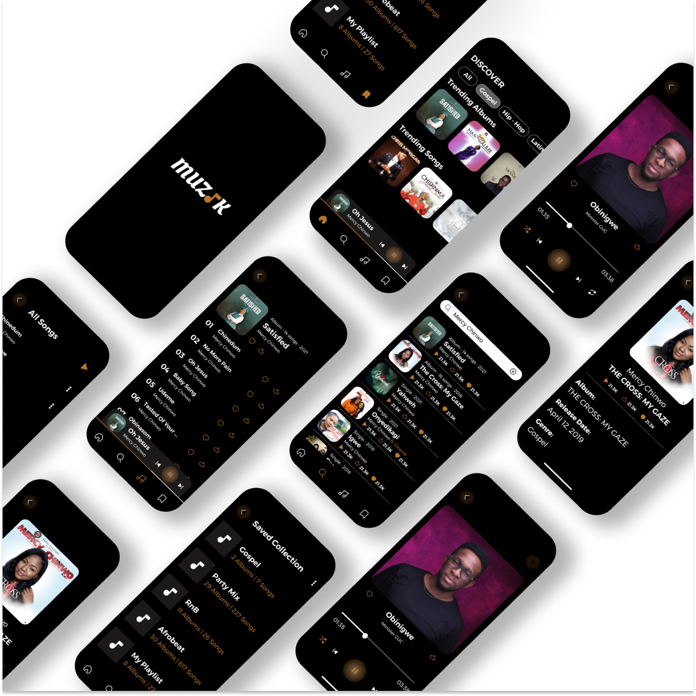
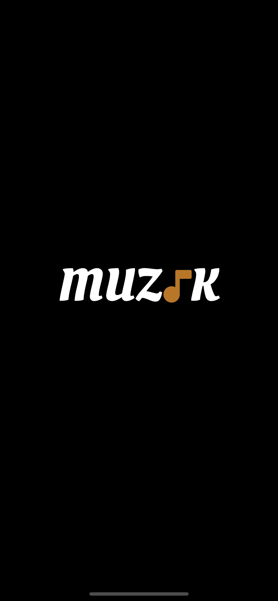
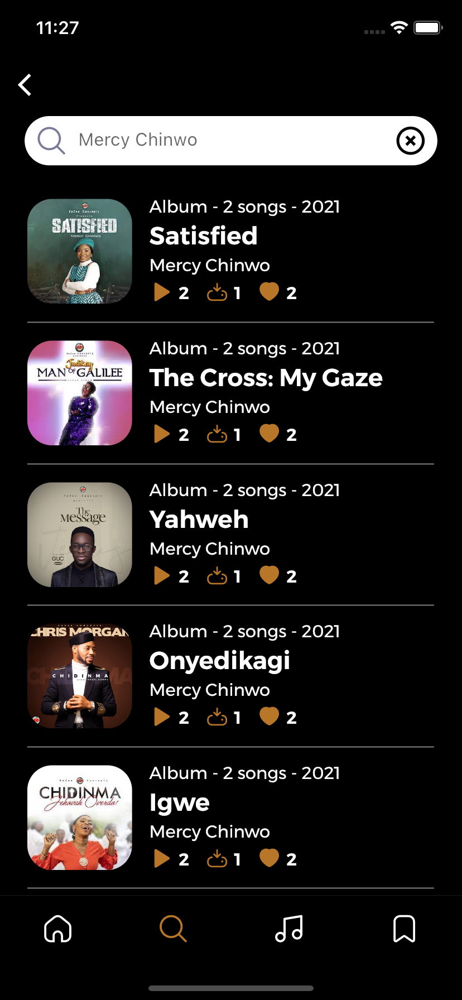
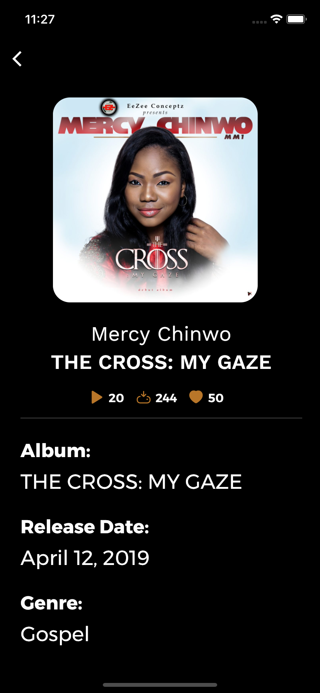
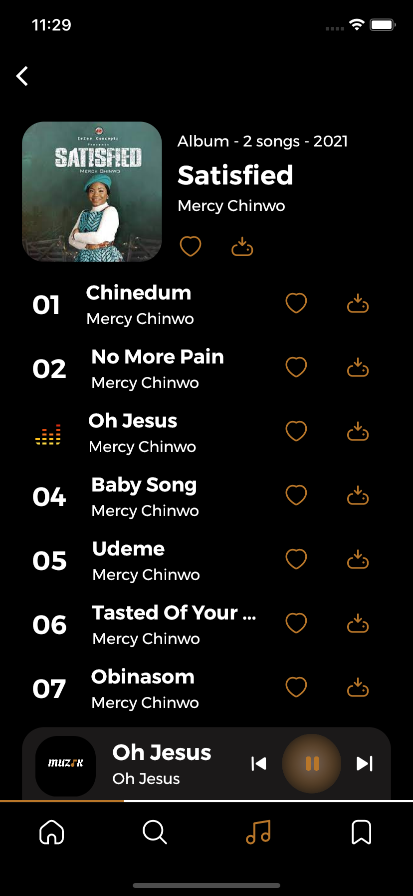
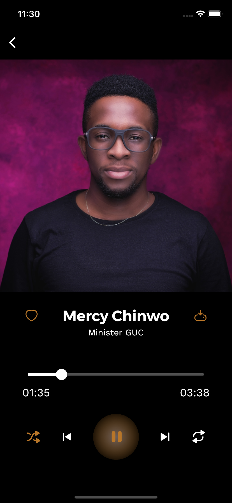

# Music App UI

A music app template

 

## ✨ Requirements

- Any Operating System (ie. MacOS X, Linux, Windows)
- Any IDE with Flutter SDK installed (ie. IntelliJ, Android Studio, VSCode etc)
- A little knowledge of Dart and Flutter
- A brain to think 🤓🤓

## build apk
flutter build apk

 

## 📸 Banner

 

 

## 📸 ScreenShots

 
 
 

 

## 🤓 Design Credit

**Victoria Okwuokenye**

&nbsp;&nbsp;

## 🤓 Author

**Bukunmi Aluko**

&nbsp;&nbsp;

 

## 😃 Show some love ❤️😍😍

Leave a 🌟

Follow for update. 😃

## Development version :hammer:
- [APK (direct download)](https://github.com/bukunmialuko/FlutterMusicAppUI/releases/download/v1.0.2/app-release.apk)

