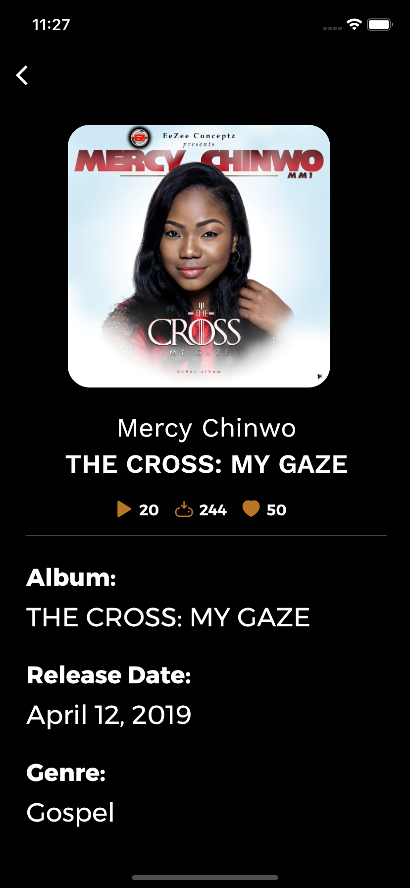
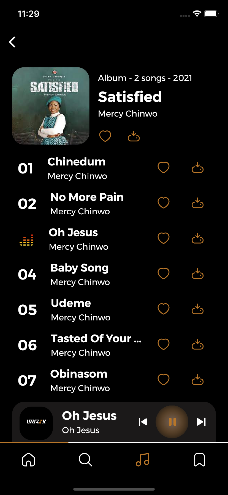
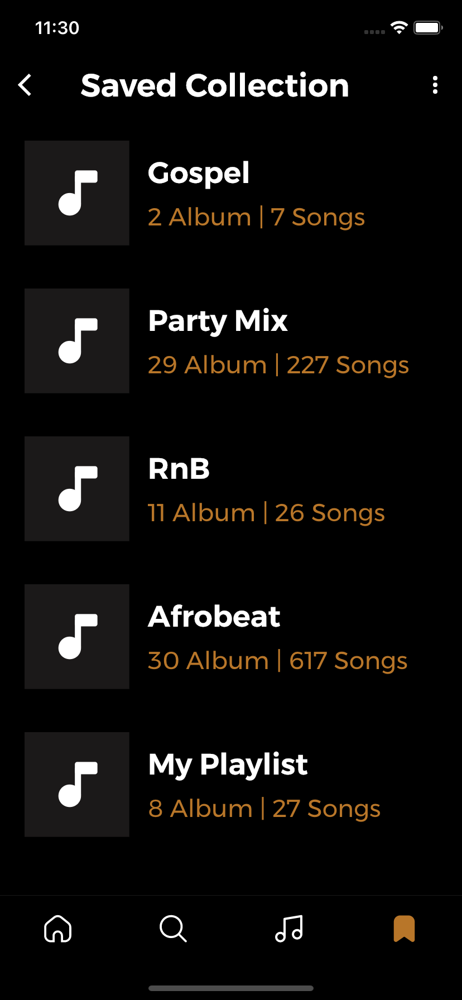

# music_app_ui

A new Flutter project.

 

## ✨ Requirements

- Any Operating System (ie. MacOS X, Linux, Windows)
- Any IDE with Flutter SDK installed (ie. IntelliJ, Android Studio, VSCode etc)
- A little knowledge of Dart and Flutter
- A brain to think 🤓🤓

 

## 📸 Banner

 

 

## 📸 ScreenShots

 
 
 

 

## 🤓 Design Credit

**Victoria Okwuokenye**
(https://www.linkedin.com/in/victoria-okwuokenye/)

## 🤓 Author

**Bukunmi Aluko**
(https://www.linkedin.com/in/bukunmi-aluko)

 

## 😃 Show some love â¤ï¸ğŸ˜ğŸ˜

Leave a 🌟

Follow for update. 😃

